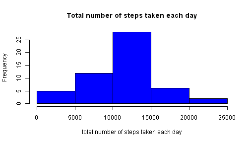
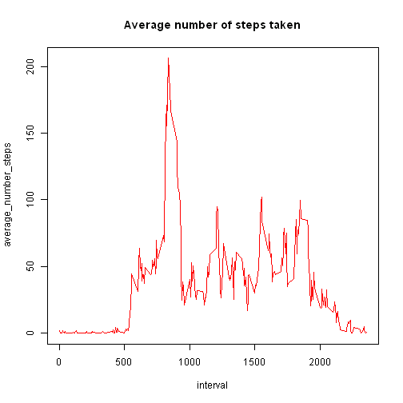
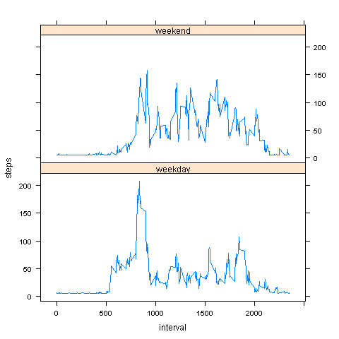

Read of data


###What is mean total number of steps taken per day?


```r
total_number_steps<-aggregate(data$steps,by=list(data$date),sum)
colnames(total_number_steps)<-c("date","total_number_steps")
```

1.histogram of the total number of steps taken each day


```r
hist(total_number_steps$total_number_steps,main='Total number of steps taken each day',xlab='total number of steps taken each day',col='blue')
```

 

2.Calculate the mean and median


```r
mean(total_number_steps$total_number_steps,na.rm=T)
```

```
## [1] 10766.19
```

```r
median(total_number_steps$total_number_steps,na.rm=T)
```

```
## [1] 10765
```
###What is the average daily activity pattern?


1.	Make a time series plot (i.e. type = "l") of the 5-minute interval (x-axis) 
and the average number of steps taken, averaged across all days (y-axis)


```r
average_number_steps<-aggregate(data$steps,by=list(data$interval),mean,na.rm=T)
colnames(average_number_steps)<-c("interval","average_number_steps")
plot( average_number_steps,type='l',col='red', main="Average number of steps taken")
```

 


2.Which 5-minute interval, on average across all the days in the dataset, 
contains the maximum number of steps?
 

```r
average_number_steps[which.max(average_number_steps$average_number_steps),]
```

```
##     interval average_number_steps
## 104      835             206.1698
```

 
###Imputing missing values
 
1.	Calculate and report the total number of missing values 
 in the dataset (i.e. the total number of rows with NAs)
  

```r
sum(is.na(data))
```

```
## [1] 2304
```
  
2.	Devise a strategy for filling in all of the missing values in the dataset. 
The strategy does not need to be sophisticated. For example, you could use the mean/median 
for that day, or the mean for that 5-minute interval, etc.
  
 To fill the missing values, I use  the mean for that 5-minute interval
  
  
3.	Create a new dataset that is equal to the original dataset but with the missing data filled in


```r
     newdata<-data
 for  (i in 1:nrow(newdata)){
     m<-newdata$steps[i]
     if (!is.na(m)) {
     newdata$steps[i]<-m
        }
     else  {
     newdata$steps[i]<-mean(average_number_steps$average_number_steps,na.rm=T)
    }
    }
```
  
 
 
 
4.	Make a histogram of the total number of steps taken each day and Calculate and report the mean and median 
total number of steps taken per day. Do these values differ from the estimates from the first part of the assignment? 
What is the impact of imputing missing data on the estimates of the total daily number of steps? 
  

```r
   number_steps<-aggregate(steps~date,data=newdata,sum,na.rm=T)
    hist(number_steps$steps,main = "Total steps taken a day", xlab = "day", col = "green")
```

 
     

```r
       mean(number_steps$steps)
```

```
## [1] 10766.19
```

```r
       median(number_steps$steps)    
```

```
## [1] 10766.19
```

The mean is the same but the median is little different.
       

###Are there differences in activity patterns between weekdays and weekends?
       
1.	Create a new factor variable in the dataset with two levels - "weekday" 
and "weekend" indicating whether a given date is a weekday or weekend day.
     

```r
newdata$datetype<-NA
newdata$datetype<-weekdays(as.Date(newdata$date))         
newdata$datetype<-ifelse(newdata$datetype %in% c("samedi","dimanche"),"weekend","weekday" )
```
         


2.	Make a panel plot containing a time series plot (i.e. type = "l") of the 5-minute interval (x-axis) 
and the average number of steps taken, averaged across all weekday days or weekend days (y-axis). 
The plot should look something like the following, which was creating using simulated data:
            
            

```r
library(lattice)
average_steps<-aggregate(steps~interval+datetype,data=newdata,mean,na.rm=T)
xyplot(steps~interval | datetype,data=average_steps, type='l', layout=c(1,2))
```

 
         
